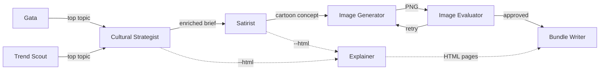
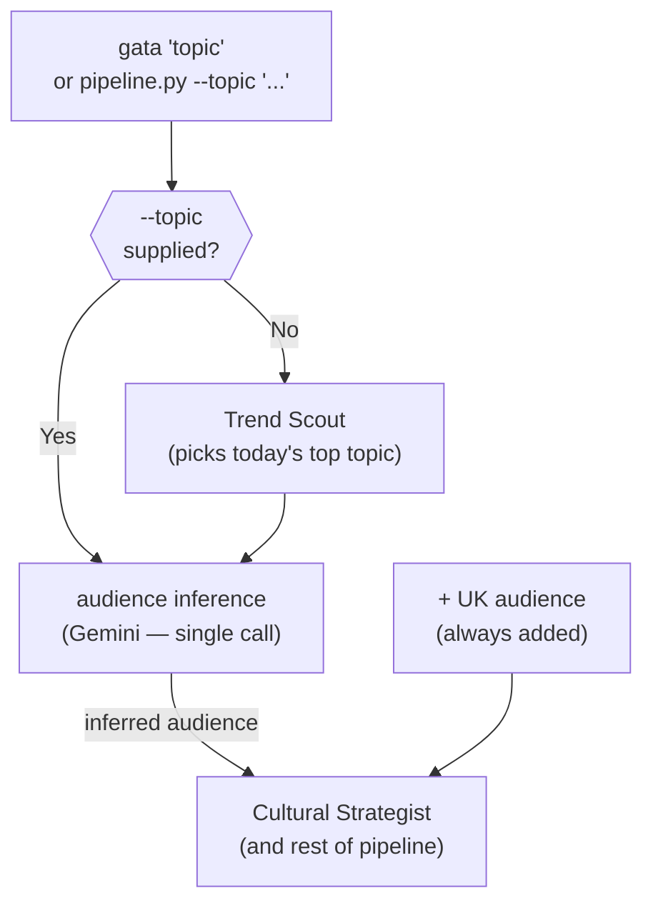
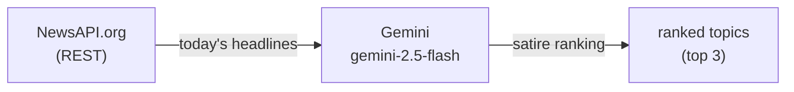
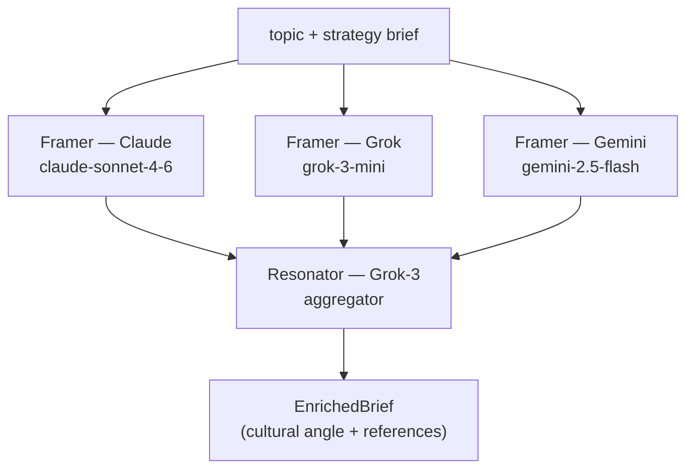
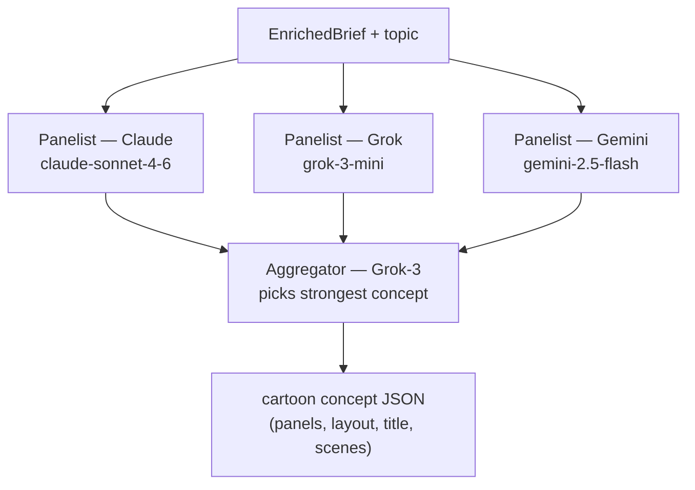
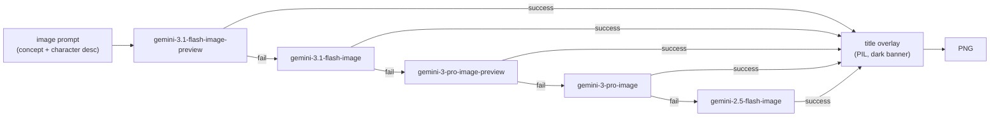
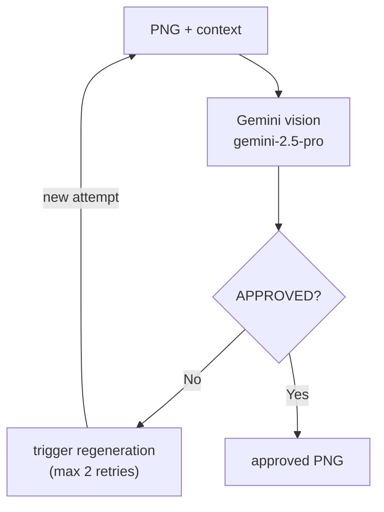
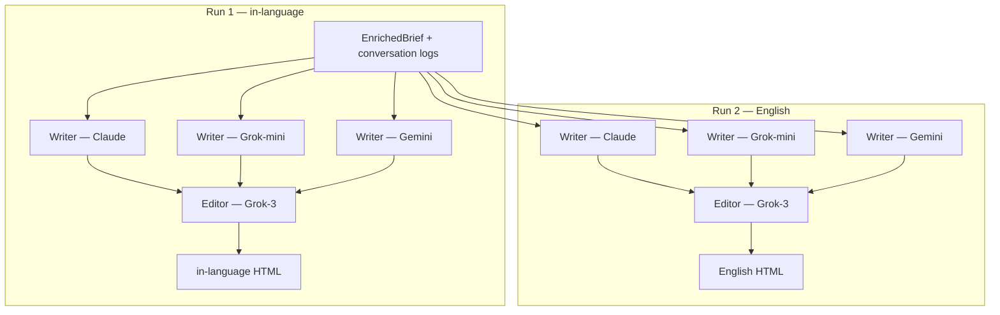
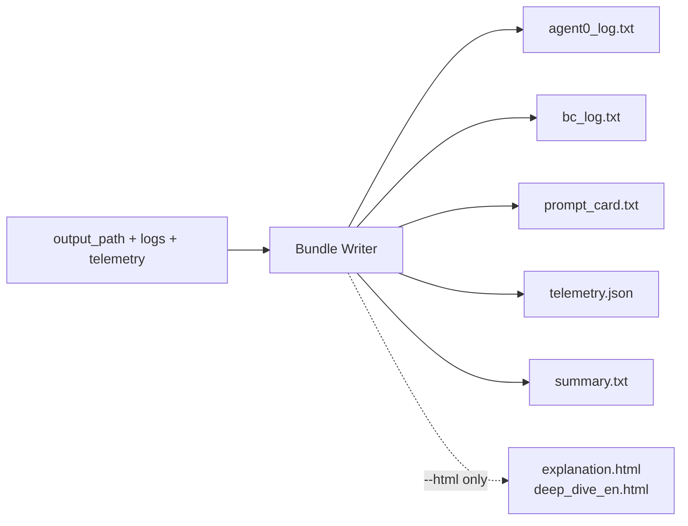

# Gata — Architecture

Gata turns a plain-text topic into satirical cartoons tailored per audience, using a
chain of specialised AI agents. Every agent is independently testable and wired together
in `core/runner.py`.

---

## High-level overview



Solid arrows are the default path. Dashed arrows run only when `--html` is set.
The HLD has two entry points into the pipeline (both feeding Cultural Strategist):
**Gata** (direct topic) and **Trend Scout** (auto-topic). Only one fires per run.

---

## Entry points

### Gata (CLI)

The `gata` command and `pipeline.py` are the two ways to start the pipeline. Both accept
a topic directly and forward it straight to the Cultural Strategist — Trend Scout does
not run.



When `--topic` is given, audience inference runs first (one Gemini call) and the result
feeds directly into the Cultural Strategist. When no topic is given, Trend Scout runs
first to pick the top satirical headline, then the same audience inference and pipeline
follow.

`pipeline.py` additionally supports `--community`, `--audience`, `--language`,
`--tone`, `--panels`, `--layout`, `--html`, and `--no-title` flags. The `gata` command
is a thin wrapper that supplies sensible defaults and exposes the most common flags.

**Example**

_Input_

```bash
gata "UK Prime Minister resigns over housing scandal"
```

_Output_

```
[INFO] inferred audience: uk-politics (British adults, dry wit)
[INFO] adding UK audience
[INFO] running pipeline for 2 audience(s)

Saved:
  uk_prime_minister_resigns_over_housing/
    uk-politics.png          ← cartoon PNG (written by Image Generator)
    uk-politics/             ← bundle folder (written by Bundle Writer)
        agent0_log.txt
        bc_log.txt
        prompt_card.txt
        telemetry.json
        summary.txt
    uk.png
    uk/
        agent0_log.txt
        bc_log.txt
        prompt_card.txt
        telemetry.json
        summary.txt
    summary.txt              ← aggregated cost + time across both audiences
```

---

## Agents

### Trend Scout

Fetches today's headlines from NewsAPI.org and ranks them by satirical potential for the
target community. Runs once per community before the rest of the pipeline.



In free-text community mode, a prior call to `infer_community_profile` (also Gemini)
derives the country and news category from the community description before the headline
fetch.

**Example**

_Input_

```
community: uk-politics
(NewsAPI fetches today's UK politics headlines — 20 articles)
```

_Output_

```
1. "Prime Minister faces second resignation call in a week"       satire score: 94
2. "Chancellor hints at emergency budget amid inflation spike"     satire score: 81
3. "NHS waiting list hits record 8 million"                        satire score: 67
```

---

### Cultural Strategist

Negotiates a cultural angle and audience-specific references for the topic. Uses the
**ParallelPanel** protocol: three independent Framers propose angles; Grok-3 (Resonator)
aggregates all proposals and picks the sharpest one.



Output is an `EnrichedBrief` containing `cultural_angle`, `culturally_loaded_references`,
and `joke_type` fields used by the Satirist.

**Example**

_Input_

```
topic:           "Prime Minister faces second resignation call in a week"
target_audience: "British adults — politically aware, dry wit"
output_language: "English"
tone:            "dry British wit"
```

_Output_

```
CULTURAL ANGLE: The PM's tenure is treated as a revolving-door tenancy — Britain
has cycled through more prime ministers than hot summers, and the public has
stopped learning their names.

REFERENCES:
- The 2022 "lettuce outlasted Liz Truss" meme (Daily Star live feed)
- The Thick of It — the PM's comms team spinning an empty room
- Number 10 Downing Street as a short-stay B&B

JOKE TYPE: absurdist comparison
```

---

### Satirist

Generates a cartoon concept from the enriched brief. Uses the **ParallelPanel** protocol:
three independent Panelists each propose a concept; Grok-3 (Aggregator) picks the
strongest and wraps it in a `<verdict>` JSON block.



The concept JSON follows the schema in `constitution.md §6`. The `title` field becomes
the headline banner overlaid on the image.

**Example**

_Input_

```
topic:          "Prime Minister faces second resignation call in a week"
cultural_angle: "Revolving-door tenancy — public has stopped learning their names"
references:     lettuce meme, The Thick of It, Number 10 as B&B
joke_type:      absurdist comparison
```

_Output_

```json
{
  "panels": 1,
  "layout": "horizontal",
  "title": "VACANCY: Must Own Own Furniture",
  "content": [
    {
      "scene": "Gata sits at her newsroom desk, studying a FOR RENT sign taped over a photo of Number 10 Downing Street. Her chalkboard — headed ON THE SPOT — shows a tally chart labelled THIS MONTH'S PMs.",
      "caption": "At press time, Gata was still waiting for the lettuce to comment.",
      "beat": "The revolving door played utterly straight. Gata is too tired to be surprised."
    }
  ]
}
```

---

### Image Generator

Renders the approved cartoon concept into a PNG. Tries Gemini image models in priority
order; falls back to the next model on any error.



The image binary is written atomically using `tempfile + os.replace()` (constitution §2).
The title overlay is suppressed when `--no-title` is set.

**Example**

_Input_ (single-panel — the `scene` field from the Satirist JSON; abbreviated)

```
Gata sits at her newsroom desk, studying a FOR RENT sign taped over a photo of
Number 10 Downing Street. Her chalkboard — headed ON THE SPOT — shows a tally
chart labelled THIS MONTH'S PMs. Gata is a domestic shorthair calico-tabby mix:
white chest, muzzle, and paws; dark grey/black tabby stripes; orange/ginger
patches on back; small dark spot on bridge of pink nose; dark leather collar
with gold/brass nameplate engraved "GATA". Serious, investigative demeanour,
slightly tired. No human clothes or accessories. Caption at bottom: "At press
time, Gata was still waiting for the lettuce to comment." Greyscale background,
Gata in full colour (Selective Color). 1970s newspaper newsroom. Fluorescent
lights, heavy metal desks, background figures. Minimalist charcoal-on-chalkboard
style. High contrast. Single-panel satirical cartoon.
```

_Output_

```
uk_prime_minister_resigns_over_housing/uk-politics.png  (1.4 MB PNG, 1024×1024)
title banner "VACANCY: MUST OWN OWN FURNITURE" overlaid as dark strip at top
```

---

### Image Evaluator

After generation, inspects the PNG for rendering artifacts (duplicate text, garbled text,
character failures) and rates whether the cartoon is genuinely funny for the target
audience. Triggers regeneration up to two times on rejection.



After three rejections the pipeline logs a warning and uses the last generated image
rather than failing the run.

**Example**

_Input_

```
cartoon.png (1.4 MB)
context: target_audience="British adults", output_language="English",
         caption="At press time, Gata was still waiting for the lettuce to comment."
```

_Output_

```
verdict: APPROVED

- Rendering artifacts: none detected
- Text legibility: chalkboard text clear, caption readable
- Gata character integrity: calico markings correct, no human clothing
- Comedy assessment: dry and on-target for a British political audience;
  lettuce reference lands for anyone who followed 2022 UK politics
```

---

### Explainer

Produces two HTML explanation pages — one in the target language (for end users) and one
in English (for operators). Uses **ParallelPanel** for each: three Writers independently
draft a page; Grok-3 (Editor) picks the best. The same aggregator `PersonaConfig` is
shared across both panel runs.



Only runs when `--html` is set.

**Example**

_Input_

```
EnrichedBrief:  cultural_angle, references, joke_type (from Cultural Strategist)
agent0_log.txt: Cultural Strategist negotiation transcript
bc_log.txt:     Satirist panel exchange transcript
image_prompt:   the full ~400-word prompt sent to Image Generator
```

_Output — in-language HTML (explanation.html, excerpt)_

```html
<h1>VACANCY: Must Own Own Furniture</h1>
<p>This cartoon lampoons the extraordinary pace at which British prime ministers
have come and gone since 2022. The "For Rent" sign on Number 10 captures the
revolving-door reality of recent UK leadership in one image.</p>
<p><strong>Cultural reference:</strong> In 2022, a Daily Star live-stream of a
lettuce outlasted Liz Truss's 45-day premiership — the joke became a global
news story before her resignation was announced.</p>
```

_Output — English deep-dive (deep_dive_en.html, excerpt)_

```html
<h2>Satirical Logic</h2>
<p>The cartoon deploys absurdist comparison: by treating Number 10 as a rental
property, it collapses the gravitas of high office into the mundane anxiety of
the UK housing market — a second crisis the audience lives daily.</p>
<h2>Cultural References Decoded</h2>
<ul>
  <li><strong>Lettuce meme (2022)</strong>: Liz Truss resigned after 45 days;
      a Daily Star lettuce live-stream became a global story.</li>
  <li><strong>The Thick of It</strong>: BBC political satire; shorthand for
      chaotic, spin-driven Westminster culture.</li>
</ul>
```

---

### Bundle Writer

Saves all outputs to disk. Not an LLM agent — pure I/O.



The cartoon PNG is written by **Image Generator** to `output_path` before Bundle Writer
runs. Bundle Writer receives `output_path` only to derive where its bundle folder should
be (`{parent}/{stem}/`).

**Example**

_Input_

```
output_path: "uk_prime_minister_resigns_over_housing/uk-politics.png"
             (path to the already-written PNG — used to derive bundle folder location)
agent0_log:  ConversationLog from Cultural Strategist
bc_log:      ConversationLog from Satirist/Co-Satirist
telemetry:   AgentTelemetry per agent
image_prompt: str (scene text for single-panel; full JSON for multi-panel)
```

_Output_

Bundle folder at `{parent(output_path)}/{stem(output_path)}/`:

```
uk_prime_minister_resigns_over_housing/
    uk-politics.png                         ← already exists (written by Image Generator)
    uk-politics/                            ← bundle folder created here
        agent0_log.txt
        bc_log.txt
        prompt_card.txt
        telemetry.json
        summary.txt
            Cultural Strategist: 4.2s — 1 iteration(s) — $0.0089
            Satirist/Co-Satirist: 6.1s — 1 iteration(s) — $0.0134
            Image Generator: 9.3s — 1 iteration(s) — $0.0400
            Image Evaluator: 2.1s — 1 iteration(s) — $0.0021

            TOTAL: 22.5s — $0.0644
    uk.png                                  ← UK audience PNG (separate pipeline run)
    uk/
        ...
    summary.txt                             ← aggregated across all audiences (written by CLI)
```

> Trend Scout does not appear in the summary when `--topic` is supplied directly — it was
> bypassed. It appears only in community-mode runs.

---

## Communication protocols

All inter-agent conversation topologies in `llm/` implement the same base interface:

```python
# llm/base.py
class ConversationProtocol(ABC):
    @abstractmethod
    def run(self, initial_input: str) -> LoopOutput: ...
```

`LoopOutput` carries `verdict` (the final output text), `log` (the full conversation for
audit), and `telemetry` (timing + token counts).

### ParallelPanel (current)

Defined in `llm/parallel_panel.py`. The active protocol for Cultural Strategist,
Satirist, and Explainer.

**How it works:**

1. Each panelist receives the same `initial_input` independently — no panelist sees
   another's output
2. Successful panelist outputs are numbered and concatenated into an aggregation message
3. The aggregator receives all concepts at once and returns the best one via a `PICK: N`
   label plus its own `<verdict>` block

```
initial_input
    │
    ├──► Panelist A ──┐
    ├──► Panelist B ──┼──► aggregation_message ──► Aggregator ──► LoopOutput
    └──► Panelist C ──┘
```

**Key properties:**
- Panelists run sequentially in code but are logically independent (no shared state)
- A panelist failure is logged and skipped; the run continues as long as at least one
  panelist succeeds
- Aggregator always runs with Grok-3 (constitution §6 amendment, v1.1)
- Single iteration — no back-and-forth; one round of proposals → one aggregation decision

### DualPersonaLoop (available)

Defined in `llm/dual_loop.py`. Implements a proposer/reviewer back-and-forth loop.

**How it works:**

1. Proposer generates a proposal
2. Reviewer evaluates and returns `<verdict>APPROVED</verdict>` or feedback
3. If approved, the loop exits early and returns the last proposal
4. If not approved and iterations remain, the proposer revises with the feedback appended
5. At the final iteration, the **Final Say Protocol** activates: the proposer must
   acknowledge all feedback, state what it is and is not adopting, and produce a genuine
   synthesis — not a restatement

```
initial_input ──► Proposer ──► Reviewer
                      ▲              │
                      │   feedback   │
                      └──────────────┘
                                     │ APPROVED or max iterations
                                     ▼
                                LoopOutput
```

**Key properties:**
- Up to `max_iterations` rounds (default 5)
- Self-review passes can be injected into both personas via `self_review_passes`
- Timeout after `timeout_seconds` (default 900 s)
- Final Say Protocol prevents deadlock at the last iteration

---

## Adding a new communication protocol

To add a new conversation topology (e.g. chain-of-thought relay, round table, tournament
bracket):

**1. Create `llm/my_protocol.py`**

```python
from llm.base import ConversationProtocol
from core.types import LoopOutput

class MyProtocol(ConversationProtocol):
    def __init__(self, ...):
        ...

    def run(self, initial_input: str) -> LoopOutput:
        # implement the conversation topology here
        # return LoopOutput(verdict=..., log=..., telemetry=...)
        ...
```

**2. Return a `LoopOutput`**

`LoopOutput` is the universal return type for all protocols. Fields:

| Field | Type | Description |
|---|---|---|
| `verdict` | `str` | The final output the agent hands to the next stage |
| `log` | `ConversationLog` | Full turn-by-turn conversation for audit and bundle writing |
| `telemetry` | `AgentTelemetry \| None` | Timing, iteration count, and token calls |

**3. Build personas with `PersonaConfig`**

```python
from core.types import PersonaConfig
from llm.claude import ClaudeProvider

persona = PersonaConfig(
    name="MyPersona",
    providers=[ClaudeProvider("claude-sonnet-4-6")],
    system_prompt="You are ...",
    max_tokens=2048,   # optional
)
```

`providers` is a fallback list — if the first provider raises an exception the protocol
tries the next one in order.

**4. Wire it into an agent**

Replace the `ParallelPanel(...)` or `DualPersonaLoop(...)` construction in the relevant
agent file with `MyProtocol(...)`. The agent's `run()` function only calls
`protocol.run(initial_input)` and unpacks `LoopOutput`, so swapping protocols requires
no other changes.

**5. Write tests**

Mock the protocol class in tests, not the individual LLM providers. The pattern used
throughout the test suite is:

```python
with patch("agents.agent_xyz.ParallelPanel") as MockPanel:
    MockPanel.return_value.run.return_value = LoopOutput(
        verdict="...", log=ConversationLog(loop_name="xyz")
    )
    result = run(topic, brief, panelist_providers, aggregator_providers)
```
