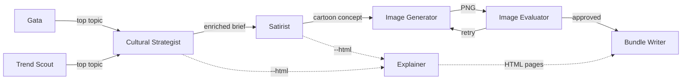
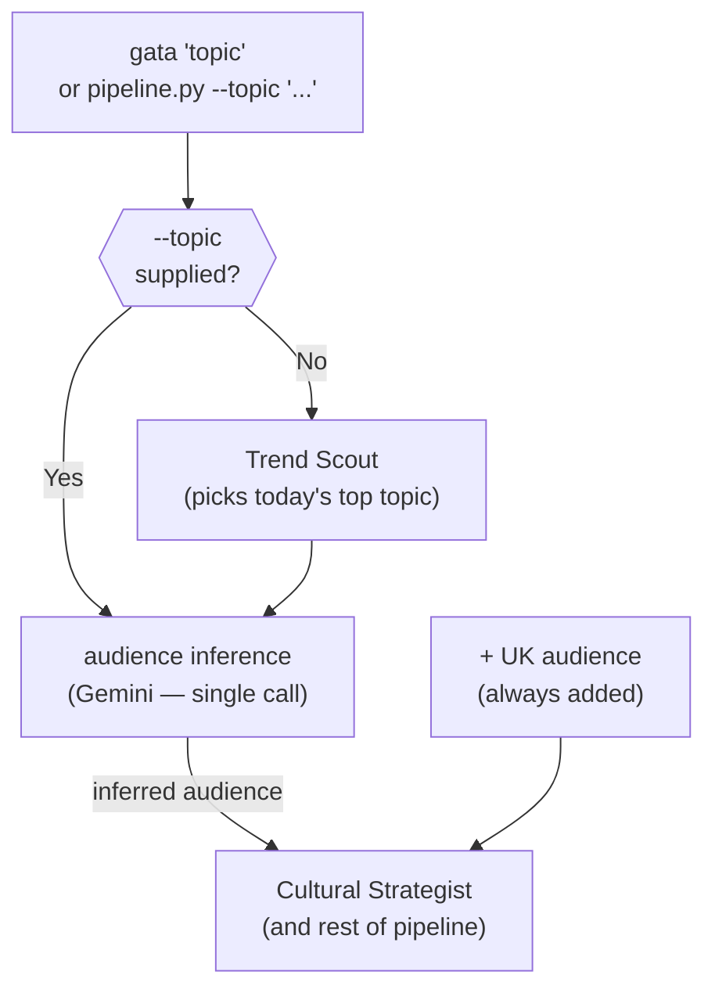
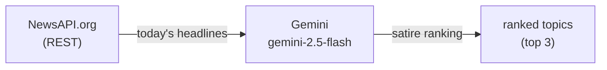
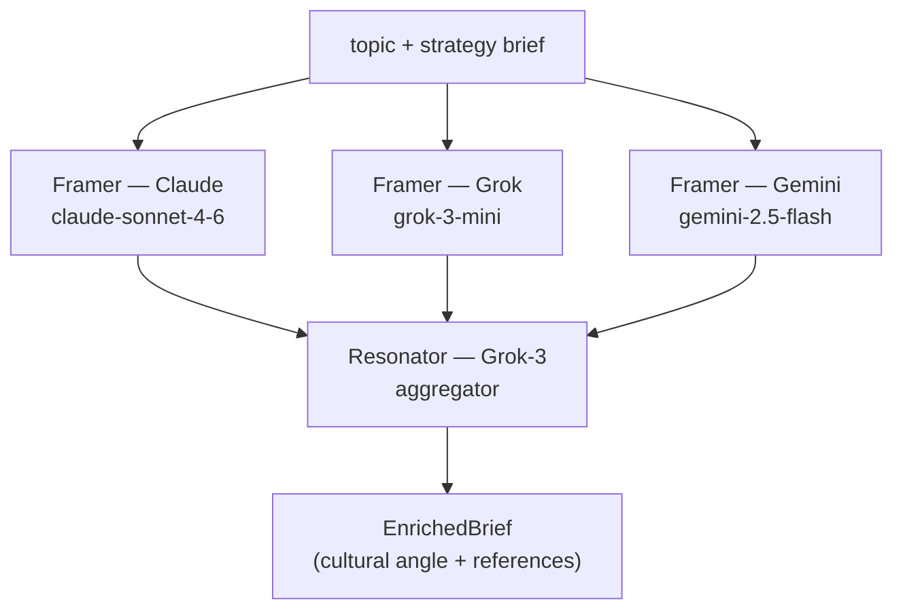
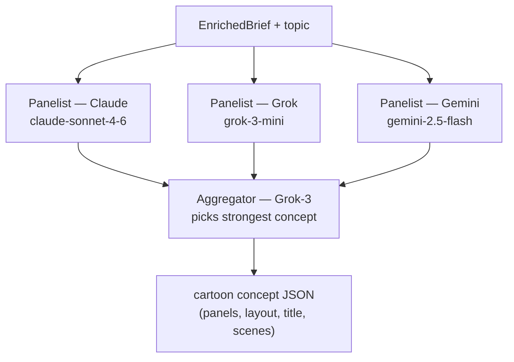
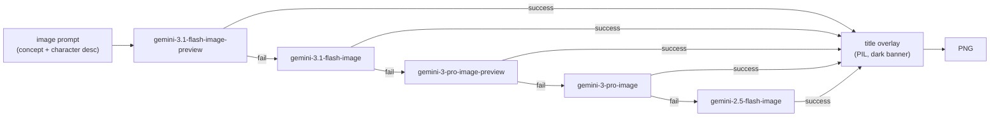
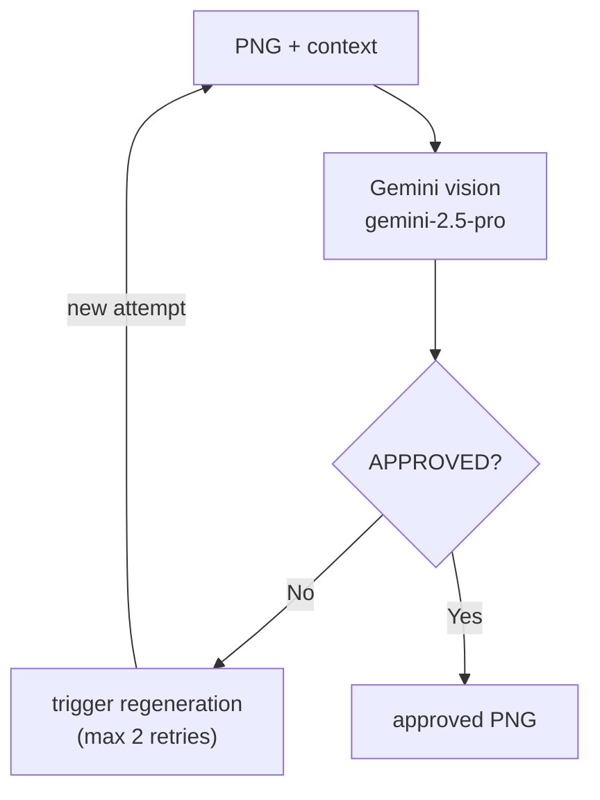
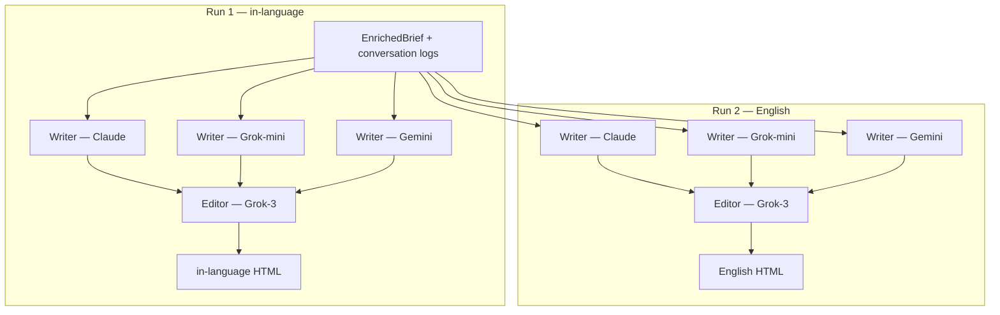
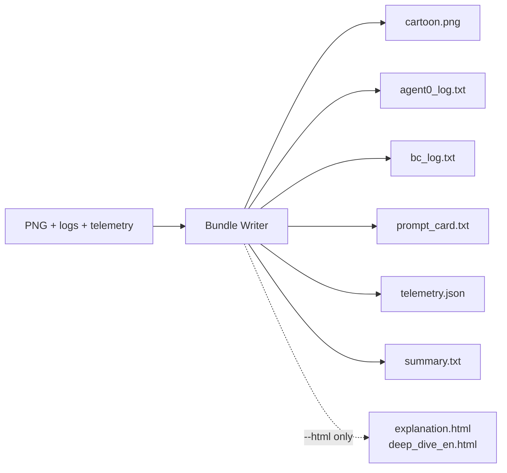

# Gata — Architecture

Gata turns a plain-text topic into satirical cartoons tailored per audience, using a
chain of specialised AI agents. Every agent is independently testable and wired together
in `core/runner.py`.

---

## High-level overview



Solid arrows are the default path. Dashed arrows run only when `--html` is set.
The HLD has two entry points into the pipeline (both feeding Cultural Strategist):
**Gata** (direct topic) and **Trend Scout** (auto-topic). Only one fires per run.

---

## Entry points

### Gata (CLI)

The `gata` command and `pipeline.py` are the two ways to start the pipeline. Both accept
a topic directly and forward it straight to the Cultural Strategist — Trend Scout does
not run.



When `--topic` is given, audience inference runs first (one Gemini call) and the result
feeds directly into the Cultural Strategist. When no topic is given, Trend Scout runs
first to pick the top satirical headline, then the same audience inference and pipeline
follow.

`pipeline.py` additionally supports `--community`, `--audience`, `--language`,
`--tone`, `--panels`, `--layout`, `--html`, and `--no-title` flags. The `gata` command
is a thin wrapper that supplies sensible defaults and exposes the most common flags.

---

## Agents

### Trend Scout

Fetches today's headlines from NewsAPI.org and ranks them by satirical potential for the
target community. Runs once per community before the rest of the pipeline.



In free-text community mode, a prior call to `infer_community_profile` (also Gemini)
derives the country and news category from the community description before the headline
fetch.

---

### Cultural Strategist

Negotiates a cultural angle and audience-specific references for the topic. Uses the
**ParallelPanel** protocol: three independent Framers propose angles; Grok-3 (Resonator)
aggregates all proposals and picks the sharpest one.



Output is an `EnrichedBrief` containing `cultural_angle`, `culturally_loaded_references`,
and `joke_type` fields used by the Satirist.

---

### Satirist

Generates a cartoon concept from the enriched brief. Uses the **ParallelPanel** protocol:
three independent Panelists each propose a concept; Grok-3 (Aggregator) picks the
strongest and wraps it in a `<verdict>` JSON block.



The concept JSON follows the schema in `constitution.md §6`. The `title` field becomes
the headline banner overlaid on the image.

---

### Image Generator

Renders the approved cartoon concept into a PNG. Tries Gemini image models in priority
order; falls back to the next model on any error.



The image binary is written atomically using `tempfile + os.replace()` (constitution §2).
The title overlay is suppressed when `--no-title` is set.

---

### Image Evaluator

After generation, inspects the PNG for rendering artifacts (duplicate text, garbled text,
character failures) and rates whether the cartoon is genuinely funny for the target
audience. Triggers regeneration up to two times on rejection.



After three rejections the pipeline logs a warning and uses the last generated image
rather than failing the run.

---

### Explainer

Produces two HTML explanation pages — one in the target language (for end users) and one
in English (for operators). Uses **ParallelPanel** for each: three Writers independently
draft a page; Grok-3 (Editor) picks the best. The same aggregator `PersonaConfig` is
shared across both panel runs.



Only runs when `--html` is set.

---

### Bundle Writer

Saves all outputs to disk. Not an LLM agent — pure I/O.



---

## Communication protocols

All inter-agent conversation topologies in `llm/` implement the same base interface:

```python
# llm/base.py
class ConversationProtocol(ABC):
    @abstractmethod
    def run(self, initial_input: str) -> LoopOutput: ...
```

`LoopOutput` carries `verdict` (the final output text), `log` (the full conversation for
audit), and `telemetry` (timing + token counts).

### ParallelPanel (current)

Defined in `llm/parallel_panel.py`. The active protocol for Cultural Strategist,
Satirist, and Explainer.

**How it works:**

1. Each panelist receives the same `initial_input` independently — no panelist sees
   another's output
2. Successful panelist outputs are numbered and concatenated into an aggregation message
3. The aggregator receives all concepts at once and returns the best one via a `PICK: N`
   label plus its own `<verdict>` block

```
initial_input
    │
    ├──► Panelist A ──┐
    ├──► Panelist B ──┼──► aggregation_message ──► Aggregator ──► LoopOutput
    └──► Panelist C ──┘
```

**Key properties:**
- Panelists run sequentially in code but are logically independent (no shared state)
- A panelist failure is logged and skipped; the run continues as long as at least one
  panelist succeeds
- Aggregator always runs with Grok-3 (constitution §6 amendment, v1.1)
- Single iteration — no back-and-forth; one round of proposals → one aggregation decision

### DualPersonaLoop (available)

Defined in `llm/dual_loop.py`. Implements a proposer/reviewer back-and-forth loop.

**How it works:**

1. Proposer generates a proposal
2. Reviewer evaluates and returns `<verdict>APPROVED</verdict>` or feedback
3. If approved, the loop exits early and returns the last proposal
4. If not approved and iterations remain, the proposer revises with the feedback appended
5. At the final iteration, the **Final Say Protocol** activates: the proposer must
   acknowledge all feedback, state what it is and is not adopting, and produce a genuine
   synthesis — not a restatement

```
initial_input ──► Proposer ──► Reviewer
                      ▲              │
                      │   feedback   │
                      └──────────────┘
                                     │ APPROVED or max iterations
                                     ▼
                                LoopOutput
```

**Key properties:**
- Up to `max_iterations` rounds (default 5)
- Self-review passes can be injected into both personas via `self_review_passes`
- Timeout after `timeout_seconds` (default 900 s)
- Final Say Protocol prevents deadlock at the last iteration

---

## Adding a new communication protocol

To add a new conversation topology (e.g. chain-of-thought relay, round table, tournament
bracket):

**1. Create `llm/my_protocol.py`**

```python
from llm.base import ConversationProtocol
from core.types import LoopOutput

class MyProtocol(ConversationProtocol):
    def __init__(self, ...):
        ...

    def run(self, initial_input: str) -> LoopOutput:
        # implement the conversation topology here
        # return LoopOutput(verdict=..., log=..., telemetry=...)
        ...
```

**2. Return a `LoopOutput`**

`LoopOutput` is the universal return type for all protocols. Fields:

| Field | Type | Description |
|---|---|---|
| `verdict` | `str` | The final output the agent hands to the next stage |
| `log` | `ConversationLog` | Full turn-by-turn conversation for audit and bundle writing |
| `telemetry` | `AgentTelemetry \| None` | Timing, iteration count, and token calls |

**3. Build personas with `PersonaConfig`**

```python
from core.types import PersonaConfig
from llm.claude import ClaudeProvider

persona = PersonaConfig(
    name="MyPersona",
    providers=[ClaudeProvider("claude-sonnet-4-6")],
    system_prompt="You are ...",
    max_tokens=2048,   # optional
)
```

`providers` is a fallback list — if the first provider raises an exception the protocol
tries the next one in order.

**4. Wire it into an agent**

Replace the `ParallelPanel(...)` or `DualPersonaLoop(...)` construction in the relevant
agent file with `MyProtocol(...)`. The agent's `run()` function only calls
`protocol.run(initial_input)` and unpacks `LoopOutput`, so swapping protocols requires
no other changes.

**5. Write tests**

Mock the protocol class in tests, not the individual LLM providers. The pattern used
throughout the test suite is:

```python
with patch("agents.agent_xyz.ParallelPanel") as MockPanel:
    MockPanel.return_value.run.return_value = LoopOutput(
        verdict="...", log=ConversationLog(loop_name="xyz")
    )
    result = run(topic, brief, panelist_providers, aggregator_providers)
```
