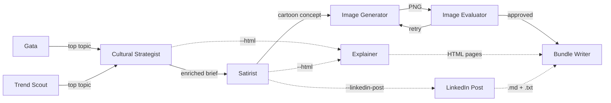
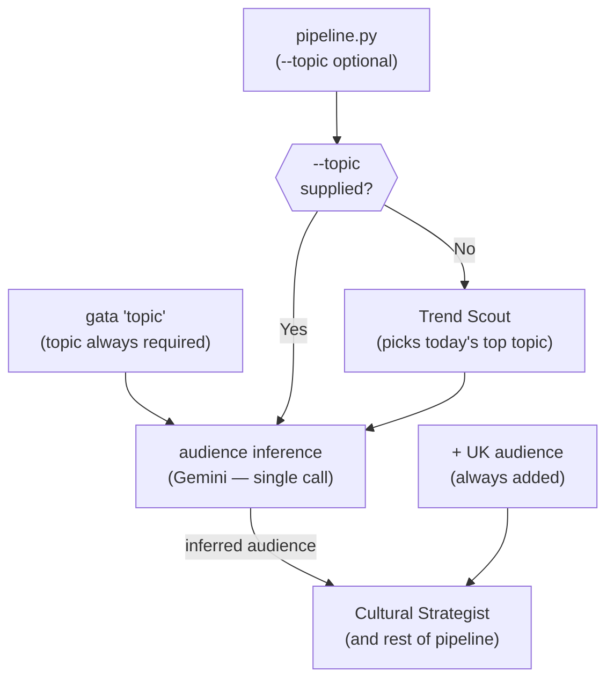
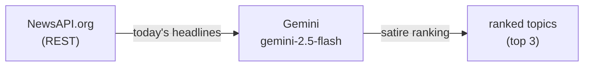
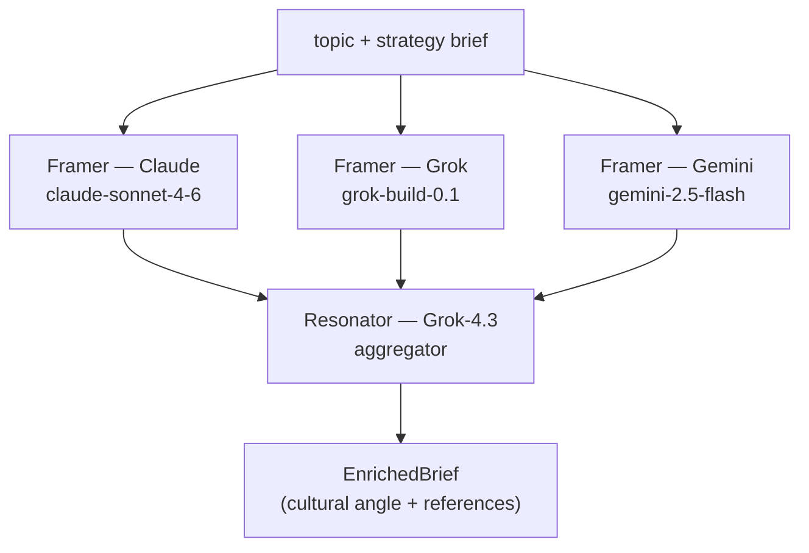
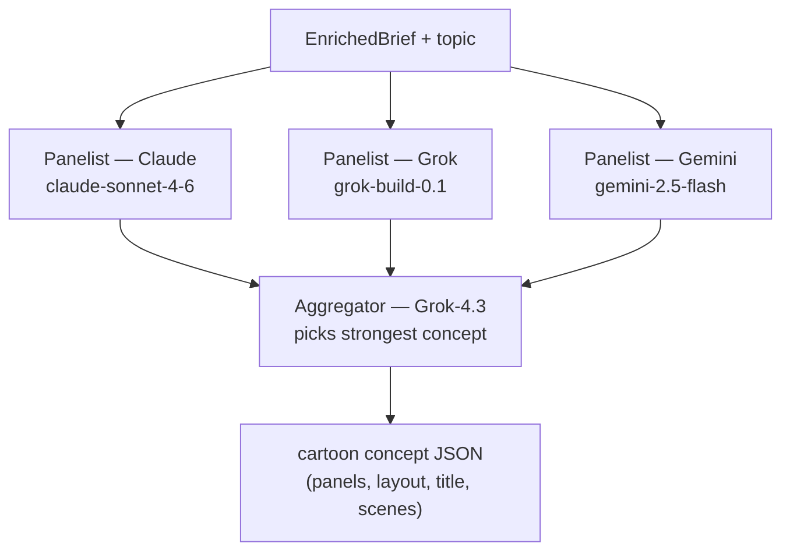
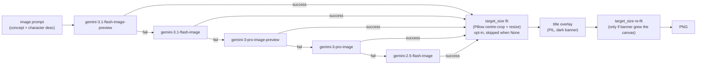
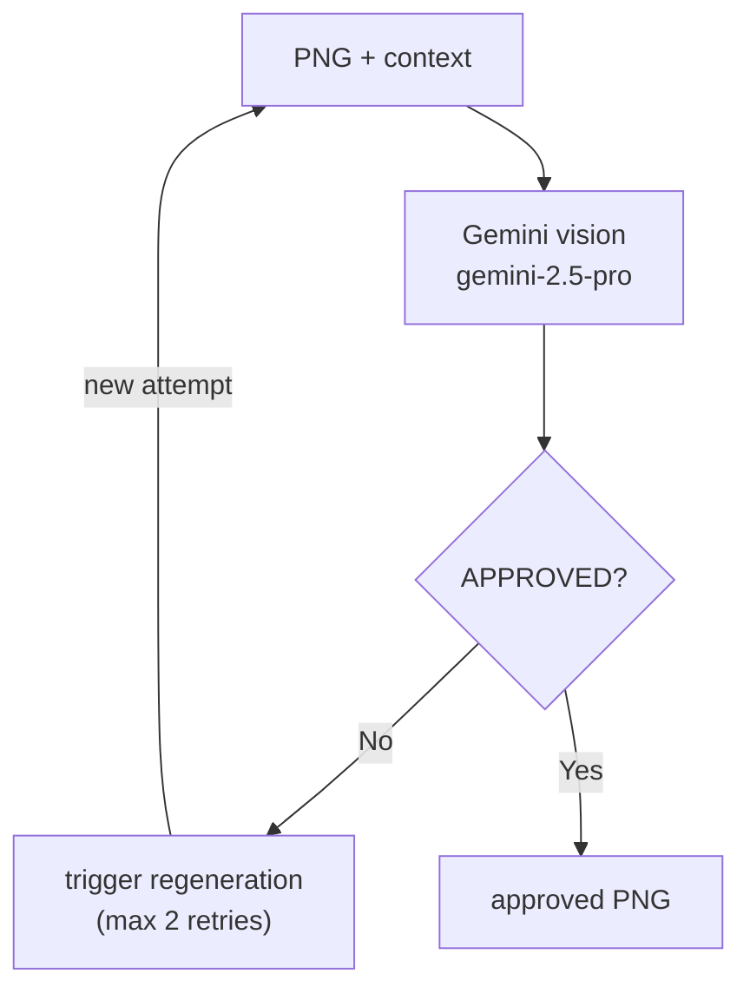
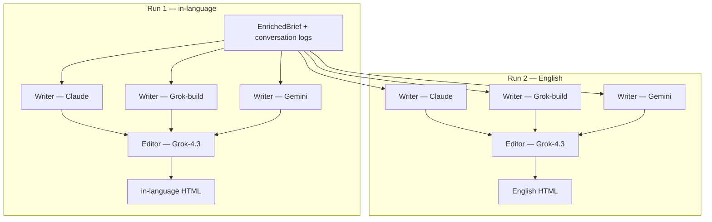
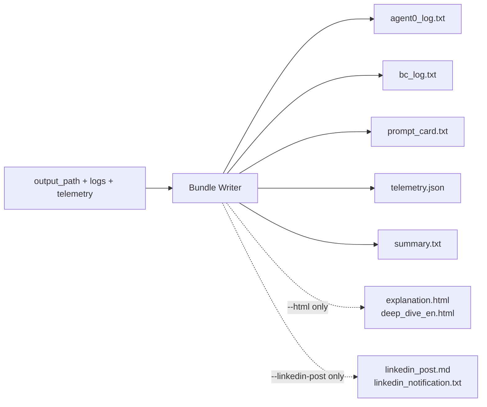

# Gata — Architecture

Gata turns a plain-text topic into satirical cartoons tailored per audience, using a
chain of specialised AI agents. Every agent is independently testable and wired together
in `core/runner.py`.

---

## High-level overview


```mermaid
flowchart LR
    GT[Gata]
    TS[Trend Scout]
    CS[Cultural Strategist]
    SAT[Satirist]
    IG[Image Generator]
    IE[Image Evaluator]
    EX[Explainer]
    LP[LinkedIn Post]
    BW[Bundle Writer]

    GT -->|top topic| CS
    TS -->|top topic| CS
    CS -->|enriched brief| SAT
    SAT -->|cartoon concept| IG
    IG -->|PNG| IE
    IE -->|retry| IG
    IE -->|approved| BW
    CS -.->|"--html"| EX
    SAT -.->|"--html"| EX
    EX -.->|HTML pages| BW
    SAT -.->|"--linkedin-post"| LP
    LP -.->|".md + .txt"| BW
```

Solid arrows are the default path. Dashed arrows run only when the corresponding flag is set.
The HLD has two entry points into the pipeline (both feeding Cultural Strategist):
**Gata** (direct topic) and **Trend Scout** (auto-topic). Only one fires per run.

---

## Entry points

### Gata (CLI)

The `gata` command and `pipeline.py` are the two ways to start the pipeline.

`gata` requires a topic — it is a mandatory positional argument. There is no auto-topic
mode: Trend Scout is never invoked by `gata`.

`pipeline.py` has an optional `--topic` flag. When omitted, Trend Scout picks the top
satirical headline automatically before the rest of the pipeline runs.


```mermaid
flowchart TD
    GATA["gata 'topic'\n(topic always required)"]
    PIPE["pipeline.py\n(--topic optional)"]
    DEC{{"--topic\nsupplied?"}}
    TS["Trend Scout\n(picks today's top topic)"]
    AUD["audience inference\n(Gemini — single call)"]
    CS["Cultural Strategist\n(and rest of pipeline)"]
    UK["+ UK audience\n(always added)"]

    GATA --> AUD
    PIPE --> DEC
    DEC -->|"Yes"| AUD
    DEC -->|"No"| TS
    TS --> AUD
    AUD -->|"inferred audience"| CS
    UK --> CS
```

For both entry points, audience inference runs after the topic is known (one Gemini call)
and the result feeds into the Cultural Strategist alongside the UK audience.

`pipeline.py` additionally supports `--community`, `--audience`, `--language`,
`--tone`, `--panels`, `--layout`, `--html`, `--no-title`, `--direct`, `--providers`,
`--linkedin-post`, and `--angle` flags. The `gata` command is a thin wrapper that
supplies sensible defaults and exposes the most common flags, including
`--linkedin-post` and `--angle`.

`--direct` skips the Cultural Strategist entirely and builds a minimal `EnrichedBrief`
directly from the topic and seed brief. This removes one agent's latency and cost when
the extra cultural enrichment is not needed. Both entry points support `--direct`.

`--providers PATH` loads a `providers.yaml` file that overrides the built-in LLM
assignments. Each provider slot is an ordered fallback chain — if the primary provider
fails, the next is tried (cross-provider fallback, Spec 032). An optional `timeout`
field per provider (Spec 036) sets a per-call budget; if exceeded, the provider is
abandoned and the next starts with its own fresh budget.

**Example**

_Input_

```bash
gata "UK Prime Minister resigns over housing scandal"
```

_Output_

```
[INFO] inferred audience: uk-politics (British adults, dry wit)
[INFO] adding UK audience
[INFO] running pipeline for 2 audience(s)

Saved:
  uk_prime_minister_resigns_over_housing/
    uk-politics.png          ← cartoon PNG (written by Image Generator)
    uk-politics/             ← bundle folder (written by Bundle Writer)
        agent0_log.txt
        bc_log.txt
        prompt_card.txt
        telemetry.json
        summary.txt
    uk.png
    uk/
        agent0_log.txt
        bc_log.txt
        prompt_card.txt
        telemetry.json
        summary.txt
    summary.txt              ← aggregated cost + time across both audiences
```

---

### Newsletter Merge (standalone script)

`newsletter_merge.py` (Spec 040) is a second, separate entry point — it does not go
through `core/runner.py` and does not appear in the high-level overview diagram above,
because it is not a stage of the per-story pipeline. It runs *after* several pipeline
runs have already completed (each generated with `--linkedin-post`), merging their
output rather than generating anything new from a topic.

Given an edition folder containing two or more story sub-folders — each named with a
leading number that fixes its position (`01_story-name`, `02_story-name`, …) — it reads
every story's `linkedin_post.md`, in that numeric order, and:

1. Runs the **Engagement Image Concept** panel (see [Agents](#agents)) over the story
   texts only, then renders the winning prompt into `engagement_image.png` — on by
   default, skippable with `--no-image` (Spec 041).
2. Hands the stories to the **Newsletter Editor** agent to merge into one draft
   document with shared boilerplate collapsed to appear once, plus a second
   `===NOTIFICATION===` section written to `edition_notification.txt` — a short,
   catchy network-facing teaser ending with a subscribe call to action (Spec 041).

Both the engagement image and the notification teaser fail soft: if either step fails,
`merged_linkedin_post.md` is still written and a warning is logged — the run only hard-
fails on the conditions listed below (bad story folders) or total exhaustion of the
merge-call fallback chain.

```bash
python newsletter_merge.py gata/newsletter/03_special_edition
python newsletter_merge.py gata/newsletter/03_special_edition --audience uk -o custom.md
python newsletter_merge.py gata/newsletter/03_special_edition --no-image
```

**Example**

_Input_

```
gata/newsletter/03_special_edition/
    01_return-to-office/uk/linkedin_post.md
    02_job-postings/uk/linkedin_post.md
    03_ai-pricing/uk/linkedin_post.md
```

_Output_

```
gata/newsletter/03_special_edition/merged_linkedin_post.md
gata/newsletter/03_special_edition/engagement_image.png
gata/newsletter/03_special_edition/edition_notification.txt
```

A story folder missing its leading number, or missing `<audience>/linkedin_post.md`,
fails the run before any LLM call is made.

---

## Agents

### Trend Scout

Fetches today's headlines from NewsAPI.org and ranks them by satirical potential for the
target community. Runs once per community before the rest of the pipeline.


```mermaid
flowchart LR
    NW["NewsAPI.org\n(REST)"]
    GM["Gemini\ngemini-2.5-flash"]
    OUT["ranked topics\n(top 3)"]

    NW -->|"today's headlines"| GM
    GM -->|"satire ranking"| OUT
```

In free-text community mode, a prior call to `infer_community_profile` (also Gemini)
derives the country and news category from the community description before the headline
fetch.

**Example**

_Input_

```
community: uk-politics
(NewsAPI fetches today's UK politics headlines — 20 articles)
```

_Output_

```
1. "Prime Minister faces second resignation call in a week"       satire score: 94
2. "Chancellor hints at emergency budget amid inflation spike"     satire score: 81
3. "NHS waiting list hits record 8 million"                        satire score: 67
```

---

### Cultural Strategist

Negotiates a cultural angle and audience-specific references for the topic. Uses the
**FairParallelPanel** protocol: three independent Framers propose angles across two
exchange rounds (sharing peer verdicts in round 2); Grok-4.3 (Resonator) aggregates all
proposals and picks the sharpest one. Skipped entirely when `--direct` is set.


```mermaid
flowchart TD
    IN["topic + strategy brief"]
    F1["Framer — Claude\nclaude-sonnet-4-6"]
    F2["Framer — Grok\ngrok-build-0.1"]
    F3["Framer — Gemini\ngemini-2.5-flash"]
    RES["Resonator — Grok-4.3\naggregator"]
    OUT["EnrichedBrief\n(cultural angle + references)"]

    IN --> F1 & F2 & F3
    F1 --> RES
    F2 --> RES
    F3 --> RES
    RES --> OUT
```

Output is an `EnrichedBrief` containing `cultural_angle`, `culturally_loaded_references`,
and `joke_type` fields used by the Satirist.

**Example**

_Input_

```
topic:           "Prime Minister faces second resignation call in a week"
target_audience: "British adults — politically aware, dry wit"
output_language: "English"
tone:            "dry British wit"
```

_Output_

```
CULTURAL ANGLE: The PM's tenure is treated as a revolving-door tenancy — Britain
has cycled through more prime ministers than hot summers, and the public has
stopped learning their names.

REFERENCES:
- The 2022 "lettuce outlasted Liz Truss" meme (Daily Star live feed)
- The Thick of It — the PM's comms team spinning an empty room
- Number 10 Downing Street as a short-stay B&B

JOKE TYPE: absurdist comparison
```

---

### Satirist

Generates a cartoon concept from the enriched brief. Uses the **FairParallelPanel**
protocol: three independent Panelists each propose a concept across two exchange rounds;
Grok-4.3 (Aggregator) picks the strongest and wraps it in a `<verdict>` JSON block.


```mermaid
flowchart TD
    IN["EnrichedBrief + topic"]
    P1["Panelist — Claude\nclaude-sonnet-4-6"]
    P2["Panelist — Grok\ngrok-build-0.1"]
    P3["Panelist — Gemini\ngemini-2.5-flash"]
    AGG["Aggregator — Grok-4.3\npicks strongest concept"]
    OUT["cartoon concept JSON\n(panels, layout, title, scenes)"]

    IN --> P1 & P2 & P3
    P1 --> AGG
    P2 --> AGG
    P3 --> AGG
    AGG --> OUT
```

The concept JSON follows the schema in `constitution.md §6`. The `title` field becomes
the headline banner overlaid on the image.

**Example**

_Input_

```
topic:          "Prime Minister faces second resignation call in a week"
cultural_angle: "Revolving-door tenancy — public has stopped learning their names"
references:     lettuce meme, The Thick of It, Number 10 as B&B
joke_type:      absurdist comparison
```

_Output_

```json
{
  "panels": 1,
  "layout": "horizontal",
  "title": "VACANCY: Must Own Own Furniture",
  "content": [
    {
      "scene": "Gata sits at her newsroom desk, studying a FOR RENT sign taped over a photo of Number 10 Downing Street. Her chalkboard — headed ON THE SPOT — shows a tally chart labelled THIS MONTH'S PMs.",
      "caption": "At press time, Gata was still waiting for the lettuce to comment.",
      "beat": "The revolving door played utterly straight. Gata is too tired to be surprised."
    }
  ]
}
```

---

### Image Generator

Renders the approved cartoon concept into a PNG. Tries Gemini image models in priority
order; falls back to the next model on any error.


```mermaid
flowchart LR
    IN["image prompt\n(concept + character desc)"]
    M1["gemini-3.1-flash-image-preview"]
    M2["gemini-3.1-flash-image"]
    M3["gemini-3-pro-image-preview"]
    M4["gemini-3-pro-image"]
    M5["gemini-2.5-flash-image"]
    TS1["target_size fit\n(Pillow centre-crop + resize)\nopt-in, skipped when None"]
    TL["title overlay\n(PIL, dark banner)"]
    TS2["target_size re-fit\n(only if banner grew the canvas)"]
    OUT["PNG"]

    IN --> M1
    M1 -->|"fail"| M2
    M2 -->|"fail"| M3
    M3 -->|"fail"| M4
    M4 -->|"fail"| M5
    M1 & M2 & M3 & M4 & M5 -->|"success"| TS1
    TS1 --> TL
    TL --> TS2
    TS2 --> OUT
```

The image binary is written atomically using `tempfile + os.replace()` (constitution §2).
The title overlay is suppressed when `--no-title` is set.

`ImageGeneration.generate()` takes an opt-in `target_size: tuple[int, int] | None`
parameter (Spec 045). When supplied, the Gemini call also gets a best-effort
`image_config.aspect_ratio` hint (whichever of Gemini's fixed presets — `1:1`,
`2:3`, `3:2`, `3:4`, `4:3`, `9:16`, `16:9`, `21:9` — is numerically closest), but the
actual guarantee comes from Pillow: the returned image is centre-cropped (never
stretched) to `target_size`'s ratio, then resized to that exact resolution, before
the atomic write. Because the title banner (when shown) is added *after* that write
and grows the canvas height, a second check runs after the overlay too — re-fitting
the file to `target_size` again if the banner pushed it off-size — so the guarantee
holds for the file actually left on disk, not just the pre-banner intermediate.
Two callers opt in with `target_size=(1200, 644)` (LinkedIn's Article/Newsletter
cover size): the newsletter Engagement Image Concept step's `engagement_image.png`
render (unconditional), and `core/runner.py`'s per-story cartoon render, but only
when `--linkedin-post` is set and the chosen layout is single-panel or horizontal —
a vertical multi-panel cartoon would be mutilated by a landscape crop, so that case
keeps `target_size=None` and its normal resolution.

The model fallback loop, atomic write, target_size correction, and title-overlay
helper live in `core/image_generation.py`'s `ImageGeneration` class (Spec 041) —
`agents/agent_image_generator.py` now only builds the prompt from the Satirist's
concept and delegates rendering to it. The newsletter Engagement Image Concept step
(see [Agents](#agents)) shares the exact same class, so both paths render through
identical code.

**Example**

_Input_ (single-panel — the `scene` field from the Satirist JSON; abbreviated)

```
Gata sits at her newsroom desk, studying a FOR RENT sign taped over a photo of
Number 10 Downing Street. Her chalkboard — headed ON THE SPOT — shows a tally
chart labelled THIS MONTH'S PMs. Gata is a domestic shorthair calico-tabby mix:
white chest, muzzle, and paws; dark grey/black tabby stripes; orange/ginger
patches on back; small dark spot on bridge of pink nose; dark leather collar
with gold/brass nameplate engraved "GATA". Serious, investigative demeanour,
slightly tired. No human clothes or accessories. Caption at bottom: "At press
time, Gata was still waiting for the lettuce to comment." Greyscale background,
Gata in full colour (Selective Color). 1970s newspaper newsroom. Fluorescent
lights, heavy metal desks, background figures. Minimalist charcoal-on-chalkboard
style. High contrast. Single-panel satirical cartoon.
```

_Output_

```
uk_prime_minister_resigns_over_housing/uk-politics.png  (1.4 MB PNG, 1024×1024)
title banner "VACANCY: MUST OWN OWN FURNITURE" overlaid as dark strip at top
```

---

### Image Evaluator

After generation, inspects the PNG for rendering artifacts (duplicate text, garbled text,
character failures) and rates whether the cartoon is genuinely funny for the target
audience. Triggers regeneration up to two times on rejection.


```mermaid
flowchart TD
    IN["PNG + context"]
    VM["Gemini vision\ngemini-2.5-pro"]
    DEC{"APPROVED?"}
    RETRY["trigger regeneration\n(max 2 retries)"]
    OUT["approved PNG"]

    IN --> VM
    VM --> DEC
    DEC -->|"No"| RETRY
    DEC -->|"Yes"| OUT
    RETRY -->|"new attempt"| IN
```

After three rejections the pipeline logs a warning and uses the last generated image
rather than failing the run.

**Example**

_Input_

```
cartoon.png (1.4 MB)
context: target_audience="British adults", output_language="English",
         caption="At press time, Gata was still waiting for the lettuce to comment."
```

_Output_

```
verdict: APPROVED

- Rendering artifacts: none detected
- Text legibility: chalkboard text clear, caption readable
- Gata character integrity: calico markings correct, no human clothing
- Comedy assessment: dry and on-target for a British political audience;
  lettuce reference lands for anyone who followed 2022 UK politics
```

---

### Explainer

Produces two HTML explanation pages — one in the target language (for end users) and one
in English (for operators). Uses **FairParallelPanel** for each: three Writers
independently draft a page across two exchange rounds; Grok-4.3 (Editor) picks the best.
The same aggregator `PersonaConfig` is shared across both panel runs.


```mermaid
flowchart TD
    IN["EnrichedBrief + conversation logs"]

    subgraph "Run 1 — in-language"
        W1a["Writer — Claude"]
        W2a["Writer — Grok-build"]
        W3a["Writer — Gemini"]
        ED1["Editor — Grok-4.3"]
        IL["in-language HTML"]
        IN --> W1a & W2a & W3a
        W1a & W2a & W3a --> ED1 --> IL
    end

    subgraph "Run 2 — English"
        W1b["Writer — Claude"]
        W2b["Writer — Grok-build"]
        W3b["Writer — Gemini"]
        ED2["Editor — Grok-4.3"]
        EN["English HTML"]
        IN --> W1b & W2b & W3b
        W1b & W2b & W3b --> ED2 --> EN
    end
```

Only runs when `--html` is set.

**Example**

_Input_

```
EnrichedBrief:  cultural_angle, references, joke_type (from Cultural Strategist)
agent0_log.txt: Cultural Strategist negotiation transcript
bc_log.txt:     Satirist panel exchange transcript
image_prompt:   the full ~400-word prompt sent to Image Generator
```

_Output — in-language HTML (explanation.html, excerpt)_

```html
<h1>VACANCY: Must Own Own Furniture</h1>
<p>This cartoon lampoons the extraordinary pace at which British prime ministers
have come and gone since 2022. The "For Rent" sign on Number 10 captures the
revolving-door reality of recent UK leadership in one image.</p>
<p><strong>Cultural reference:</strong> In 2022, a Daily Star live-stream of a
lettuce outlasted Liz Truss's 45-day premiership — the joke became a global
news story before her resignation was announced.</p>
```

_Output — English deep-dive (deep_dive_en.html, excerpt)_

```html
<h2>Satirical Logic</h2>
<p>The cartoon deploys absurdist comparison: by treating Number 10 as a rental
property, it collapses the gravitas of high office into the mundane anxiety of
the UK housing market — a second crisis the audience lives daily.</p>
<h2>Cultural References Decoded</h2>
<ul>
  <li><strong>Lettuce meme (2022)</strong>: Liz Truss resigned after 45 days;
      a Daily Star lettuce live-stream became a global story.</li>
  <li><strong>The Thick of It</strong>: BBC political satire; shorthand for
      chaotic, spin-driven Westminster culture.</li>
</ul>
```

---

### LinkedIn Post

Generates a **researched, non-satirical** companion article (`linkedin_post.md`)
and a serious push-notification teaser (`linkedin_notification.txt`). Only runs
when `--linkedin-post` is set. Unlike the cartoon, this article deliberately drops
Gata's sardonic voice — professional, analytical register, no jokes, no feline
metaphors — on the premise that the cartoon already carries the joke, so the text
should carry something the image can't (Spec 042).

**Five stages, each using the same panelist/aggregator providers already
configured for the Satirist:**

1. **Independent research** — each of the three panelist providers performs its
   own real, provider-native web search on the topic (plus any operator-supplied
   `--angle` values): Gemini via its existing Google Search grounding tool,
   Claude via Anthropic's `web_search_20250305` tool, Grok via xAI's Agent Tools
   `web_search` tool (all three access their SDK client directly via a `client`
   property — see [FairParallelPanel](#fairparallelpanel-current)). Each runs in
   parallel, bounded by a 120-second timeout; one provider's failure only affects
   that provider — it proceeds ungrounded, explicitly instructed not to present
   unverified claims as fact, rather than aborting the whole run. Only if *all
   three* fail does the feature soft-fail entirely. The shared research query
   (Spec 042 amendment 2, 2026-08-29) also steers every provider toward
   academic, government, or otherwise highly-reputable sources — a best-effort
   nudge; stage 2 below is the actual enforcement.
2. **Domain classification & filtering** (Spec 042 amendment 2) — immediately
   after all three research calls return, every source domain not already in
   the local `source_domains.duckdb` cache (gitignored — a regenerating cache,
   not a hand-edited config; grows on disk, never fully loaded into memory) is
   classified by a dedicated `FairParallelPanel` (panelists named by
   `model_id`, aggregator named **Source Classifier**, `panelist_timeout=90`,
   `iterations=3` — one more than the class default, since a small/empty cache
   is expected to disagree more before converging). Each domain is judged on
   two independent axes: paywalled (bool) and reliability (`high`/`low`). Any
   source whose domain comes back paywalled or low-reliability is stripped
   from that digest's sources — logged at WARNING, naming the domain and why —
   **before** angle-planning or writing ever sees it. A domain with no
   classification at all (cache miss and the panel itself failed) is treated
   as eligible: filtering only ever excludes a *positively classified* bad
   domain, never an unknown one, so a total classification failure degrades to
   the pre-amendment unfiltered behaviour rather than zeroing out research
   entirely. True pre-fetch gating (classifying a URL before any provider's
   own search tool reads it) isn't possible — each provider's search is a
   server-side black box; this is the earliest point the pipeline can act.
3. **Angle planning** — a `FairParallelPanel` run (panelists named by `model_id`,
   aggregator named **Managing Editor**, default 60s timeout) where each panelist
   proposes 2–4 distinct angles from its *own* (already-filtered) research. Any
   operator-supplied `--angle` values (repeatable flag) are mandatory inclusions
   in the final set.
4. **Writing** — a second `FairParallelPanel` run (same panelists/aggregator,
   `panelist_timeout=120` — longer than the 60s default because its prompt
   embeds a full research digest and its output targets 500–800 words) drafts
   the article from the agreed angles, one section per angle. Each panelist's
   *own* research digest is embedded into that panelist's own system prompt —
   not `FairParallelPanel`'s shared input, which stays the same for everyone
   (topic + operator angles only) — so the protocol class itself needed no
   changes. Every panelist is also given the same numbered list of filtered,
   merged candidate sources and told to cite inline as `[N]` against it,
   aiming for roughly 2 citations per body section (Spec 042 amendment 2).
   `FairParallelPanel` itself gained one new capability for this: an optional
   `round_validator` hook (`None` for every other caller — Cultural Strategist,
   Satirist, Explainer, Engagement Image Concept, and this feature's own
   research/angle-planning stages are all unaffected), called after each
   non-final round with that round's survivors' verdicts; here it flags any
   panelist whose body has a section citing more than 2 sources, and its
   returned feedback text is folded into that panelist's next-round prompt —
   a best-effort mid-deliberation nudge, not the actual enforcement (see
   Assembly below).
5. **Assembly** — five `===MARKER===`-delimited sections come back from the
   writing panel:

| Marker | Content |
|--------|---------|
| `TITLE` | Article H1 — professional, punchy |
| `EXECUTIVE_SUMMARY` | 3–5 sentence summary of the article's core finding, its own section (Spec 042 amendment 2026-08-29) |
| `BODY` | One section per agreed angle — no separate introduction, that role belongs to `EXECUTIVE_SUMMARY` |
| `COMMENT` | One serious, substantive discussion question |
| `NOTIFICATION` | 2–3 sentence serious LinkedIn teaser |

The final Markdown is assembled as: title, a code-inserted **Executive Summary**
heading wrapping the panel's own summary text (omitted entirely if empty) + the
article body + the static closing block (repost ask, comment question, subscribe
link), then a **Sources** section, then the static tech-stack "Behind the Scenes"
body — now ending with a real-metrics telemetry caption and the **code-inserted**
AI-authorship disclosure (never LLM-authored). Both of those used to sit
immediately after the title; a 2026-08-29 amendment to Spec 042 (Living Spec —
CLAUDE.md RULE 18) moved them to the bottom, as closing/meta information rather
than a lead-in, and gave the lead paragraph its own labelled Executive Summary
section — matching the manual cleanup pass the operator was doing to every
generated article before publishing it.

The Sources section itself was further amended the same day (Spec 042
amendment 2): rather than publishing the full deduplicated union of every
panelist's sources regardless of whether the article actually used them, code
now determines exactly which numbered candidates were cited (scanning the
summary and body for `[N]` markers, in first-appearance order), drops any
invalid/hallucinated index, keeps at most 15 distinct citations (stripping any
beyond that from the text), and renumbers the survivors sequentially so the
visible `1.`, `2.`, ... list matches the in-text `[N]` markers exactly. A
source's **URL** is still never parsed from or trusted to LLM output, so no
citation's link can be fabricated — the writer only ever selects *which*
code-supplied candidate to cite by number; a source's **title**, as a last
resort, may be text the source's own provider supplied (see below), but only
for a URL already independently verified via that provider's own
citation/grounding metadata.

Spec 043 unified every source in the list to `"{domain} - {page title}"`,
regardless of provider — the three started out inconsistent. Gemini's Google
Search grounding API only ever returns a bare domain as a source's title
(confirmed live — its `.title` field is literally e.g. `"ibm.com"`, and
`.domain` is always unset); xAI's citation `title` field turned out to be the
in-text footnote number, not a title at all (also confirmed live); only
Claude's citation API already returned a real title. For Gemini (redirect
URLs) and Grok (real, direct URLs), a shared resolver fetches the URL directly
via `httpx` (parallel across all of one call's sources, 5s per-URL budget,
with a browser-like `User-Agent` header — confirmed live that Wikipedia and
likely other sites 403 requests without one) and reads the destination page's
real `<title>`. Claude needs no fetch — its own title is already good, and
this step just prepends the domain to it.

Spec 044 found that a single-tier `<title>`-only fetch still wasn't enough:
bot-gated sites (Facebook, Reddit, ScienceDirect, Fidelity) commonly 403 or
serve a generic shell page, sometimes yielding a `<title>` that's only the
site's own name (`"Reddit"`). `_resolve_sources` (shared by all three
providers) now tries, in order: (1) the source's own raw candidate title —
Claude's real citation title, or the bare-domain seed for Gemini/Grok; (2) a
live fetch's `<title>`, then `og:title`, then `twitter:title` — many gated
sites still render these for link-preview purposes; (3) a humanised URL-path
slug, since sites like Medium and Facebook encode the real post text
directly in their own URL; (4) a title the source's own provider supplies in
the *same* research call, via a `===SOURCE_TITLES===` block appended after
its normal response — no second call, and matched strictly by URL against
that provider's own verified citations so an LLM can never introduce a new,
unverified source. A candidate is rejected as non-descriptive whenever,
once normalised, it's empty or amounts to nothing but the domain itself
(its label, e.g. `"reddit"`, or the full form, e.g. `"reddit.com"`). A
source for which none of the four steps yields anything descriptive is
**dropped from the published list** — this replaced Spec 043's
bare-domain-as-final-fallback, since a bare domain is exactly the pattern
this spec exists to eliminate. Every failure along the chain — a fetch
error, a missing/malformed provider-titles block, a dropped source — is
logged at `DEBUG` and never blocks or fails the research step it belongs to.

Any stage's total failure (all research, all angle-planning panelists, or all
writing panelists) is non-fatal: a WARNING is logged and neither file is written;
the rest of the bundle — including the cartoon — is unaffected.

---

### Newsletter Editor

Invoked only by the standalone `newsletter_merge.py` script (see
[Newsletter Merge](#newsletter-merge-standalone-script)) — not part of the `gata` /
`pipeline.py` flow and never called from `core/runner.py`.

Merges N already-written `linkedin_post.md` files (N ≥ 2) into one edition draft, in an
operator-fixed order (each story folder's leading number), consolidating any content
repeated across stories into a single shared section. Sends text only — no images, to
keep the call cheap and fast.

Makes one successful call against an ordered fallback chain: every active Gemini text
model, cheapest combined per-million-token rate first, then Claude/Grok models (also
cheapest first) only if every Gemini option fails. Every attempt — success or failure —
is logged with model, tokens, and cost.

The response is two `===MARKER===`-delimited sections (Spec 041):

| Marker | Content |
|--------|---------|
| `ARTICLE` | The merged newsletter edition itself, ending with the total cost line |
| `NOTIFICATION` | 2–4 sentence catchy network-facing teaser, in Gata's voice, ending with a subscribe call to action — no follower/subscriber counts |

`parse_merge_response()` splits the two apart leniently: a response missing
`===NOTIFICATION===` still yields a usable article (only the teaser file is skipped);
a response missing `===ARTICLE===` still publishes whatever text came back, unparsed.

Before calling, the script sums every story's stored `"Image Generator"` cost from its
own `telemetry.json` (all iterations, not just the approved one), the exact cost of the
Engagement Image Concept panel and rendering (when it succeeded), and adds a
conservative estimate for the merge call itself, using the priciest model in the whole
chain and its `max_tokens` ceiling — so the estimate is never an undercount of what the
call could actually cost. The model is instructed to append that total, plus a fixed
note that human review time isn't included, as the last line of the `ARTICLE` section.

The output is always a draft: nothing publishes automatically, and no template-shape
validation is applied to the input `linkedin_post.md` files — a human reviews and edits
the merged result before posting.

---

### Engagement Image Concept

Invoked only by `newsletter_merge.py`, before the Newsletter Editor call, unless
`--no-image` is set (Spec 041). Produces one image-generation prompt that visually
unifies an entire edition, rendered into `engagement_image.png`.

Reuses `FairParallelPanel` — the same protocol as Cultural Strategist and Satirist —
over the edition's `linkedin_post.md` texts only; no story's rendered image is ever
sent, avoiding a literal collage of mismatched art. Panelists are named by their
`model_id` (mirroring Cultural Strategist); the aggregator is named **Art Director**.
Both the panelist and aggregator system prompts restate the mandatory Constitution §5
visual style (greyscale background, Gata in Selective Color, 1970s newsroom setting,
`ON THE SPOT` chalkboard) — there is no cover-image carve-out from that rule.

The winning prompt is rendered by the same `core/image_generation.py` `ImageGeneration`
class the per-story pipeline uses (see [Image Generator](#image-generator)) — no title
banner is applied, and `target_size=(1200, 644)` is always passed (Spec 045) so the
saved file exactly matches LinkedIn's Article/Newsletter cover spec regardless of what
resolution Gemini actually returns. Any failure (every panelist failing, or every image
model failing) is a soft failure: a warning is logged, no `engagement_image.png` is
written, and the merge-text step proceeds unaffected.

---

### Bundle Writer

Saves all outputs to disk. Not an LLM agent — pure I/O.


```mermaid
flowchart LR
    IN["output_path + logs + telemetry"]
    BW["Bundle Writer"]
    F2["agent0_log.txt"]
    F3["bc_log.txt"]
    F4["prompt_card.txt"]
    F5["telemetry.json"]
    F6["summary.txt"]
    FH["explanation.html\ndeep_dive_en.html"]
    FL["linkedin_post.md\nlinkedin_notification.txt"]

    IN --> BW
    BW --> F2 & F3 & F4 & F5 & F6
    BW -.->|"--html only"| FH
    BW -.->|"--linkedin-post only"| FL
```

The cartoon PNG is written by **Image Generator** to `output_path` before Bundle Writer
runs. Bundle Writer receives `output_path` only to derive where its bundle folder should
be (`{parent}/{stem}/`).

**Example**

_Input_

```
output_path: "uk_prime_minister_resigns_over_housing/uk-politics.png"
             (path to the already-written PNG — used to derive bundle folder location)
agent0_log:  ConversationLog from Cultural Strategist
bc_log:      ConversationLog from Satirist/Co-Satirist
telemetry:   AgentTelemetry per agent
image_prompt: str (scene text for single-panel; full JSON for multi-panel)
```

_Output_

Bundle folder at `{parent(output_path)}/{stem(output_path)}/`:

```
uk_prime_minister_resigns_over_housing/
    uk-politics.png                         ← already exists (written by Image Generator)
    uk-politics/                            ← bundle folder created here
        agent0_log.txt
        bc_log.txt
        prompt_card.txt
        telemetry.json
        summary.txt
            Cultural Strategist: 4.2s — 1 iteration(s) — $0.0089
            Satirist/Co-Satirist: 6.1s — 1 iteration(s) — $0.0134
            Image Generator: 9.3s — 1 iteration(s) — $0.0400
            Image Evaluator: 2.1s — 1 iteration(s) — $0.0021

            TOTAL: 22.5s — $0.0644
    uk.png                                  ← UK audience PNG (separate pipeline run)
    uk/
        ...
    summary.txt                             ← aggregated across all audiences (written by CLI)
```

> Trend Scout does not appear in the summary when `--topic` is supplied directly — it was
> bypassed. It appears only in community-mode runs.

---

## Communication protocols

All inter-agent conversation topologies in `llm/` implement the same base interface:

```python
# llm/base.py
class ConversationProtocol(ABC):
    @abstractmethod
    def run(self, initial_input: str) -> LoopOutput: ...
```

`LoopOutput` carries `verdict` (the final output text), `log` (the full conversation for
audit), and `telemetry` (timing + token counts).

### FairParallelPanel (current)

Defined in `llm/fair_parallel_panel.py`. The active protocol for Cultural Strategist,
Satirist, and Explainer (replaces `ParallelPanel` as of Spec 034), reused as-is by
the newsletter Engagement Image Concept step (Spec 041), and by the LinkedIn Post
agent's three sequential panel stages — domain classification, angle planning, and
writing (Spec 042). Each new use is a single deliberation producing one text output
(an image prompt, a domain-verdict JSON object, an angle set, or an article),
rather than a new bespoke protocol — including cases needing per-panelist-distinct
context (each LinkedIn Post panelist's own research), met by varying each
`PersonaConfig.system_prompt` rather than modifying this class.

**How it works:**

1. **Round 1** — all panelists receive the same `initial_input` and respond in parallel
   threads; no panelist sees another's output
2. **Round 2–N** — each surviving panelist receives a composite prompt that includes its
   own round-1 response plus all peers' round-1 verdicts; they run in parallel again
3. **Aggregation** — the aggregator receives each panelist's *final-round* verdict and
   returns the best one via a `PICK: N` label plus its own `<verdict>` block

```
initial_input
    │
    ├──► Panelist A (round 1) ──┐  peer verdicts  ┌── Panelist A (round 2) ──┐
    ├──► Panelist B (round 1) ──┼────────────────►├── Panelist B (round 2) ──┼──► Aggregator ──► LoopOutput
    └──► Panelist C (round 1) ──┘                 └── Panelist C (round 2) ──┘
```

**Key properties:**
- Panelists run in true parallel threads via `concurrent.futures.ThreadPoolExecutor`
- A panelist that times out (`panelist_timeout=60s` outer budget) or fails is dropped;
  the run continues as long as at least one panelist survives
- Default: `iterations=2` (one round of peer sharing before aggregation)
- Per-provider timeout (Spec 036): each provider in a fallback chain can have its own
  `timeout` field in `providers.yaml`; if it stalls, the next provider starts fresh
- Aggregator always runs with Grok-4.3
- Optional `round_validator` hook (Spec 042 amendment 2, 2026-08-29): a
  `Callable[[dict[str, str]], dict[str, str]]` called after each non-final
  round with that round's survivors' verdicts; any entry in its returned dict
  is appended to that panelist's next-round prompt as extra guidance,
  alongside the peer verdicts. Defaults to `None`, so every caller above except
  LinkedIn Article Writing (which uses it to nudge a panelist that's over-
  citing one section) is unaffected.

### ParallelPanel (legacy)

Defined in `llm/parallel_panel.py`. Superseded by `FairParallelPanel`. Kept in the
codebase for reference but no longer used by any agent.

Single-round: panelists respond independently (no peer sharing), outputs are
concatenated, aggregator picks the best. Sequential execution — no parallel threads.

### DualPersonaLoop (available)

Defined in `llm/dual_loop.py`. Implements a proposer/reviewer back-and-forth loop.

**How it works:**

1. Proposer generates a proposal
2. Reviewer evaluates and returns `<verdict>APPROVED</verdict>` or feedback
3. If approved, the loop exits early and returns the last proposal
4. If not approved and iterations remain, the proposer revises with the feedback appended
5. At the final iteration, the **Final Say Protocol** activates: the proposer must
   acknowledge all feedback, state what it is and is not adopting, and produce a genuine
   synthesis — not a restatement

```
initial_input ──► Proposer ──► Reviewer
                      ▲              │
                      │   feedback   │
                      └──────────────┘
                                     │ APPROVED or max iterations
                                     ▼
                                LoopOutput
```

**Key properties:**
- Up to `max_iterations` rounds (default 5)
- Self-review passes can be injected into both personas via `self_review_passes`
- Timeout after `timeout_seconds` (default 900 s)
- Final Say Protocol prevents deadlock at the last iteration

---

## Adding a new communication protocol

To add a new conversation topology (e.g. chain-of-thought relay, round table, tournament
bracket):

**1. Create `llm/my_protocol.py`**

```python
from llm.base import ConversationProtocol
from core.types import LoopOutput

class MyProtocol(ConversationProtocol):
    def __init__(self, ...):
        ...

    def run(self, initial_input: str) -> LoopOutput:
        # implement the conversation topology here
        # return LoopOutput(verdict=..., log=..., telemetry=...)
        ...
```

**2. Return a `LoopOutput`**

`LoopOutput` is the universal return type for all protocols. Fields:

| Field | Type | Description |
|---|---|---|
| `verdict` | `str` | The final output the agent hands to the next stage |
| `log` | `ConversationLog` | Full turn-by-turn conversation for audit and bundle writing |
| `telemetry` | `AgentTelemetry \| None` | Timing, iteration count, and token calls |

**3. Build personas with `PersonaConfig`**

```python
from core.types import PersonaConfig
from llm.claude import ClaudeProvider

persona = PersonaConfig(
    name="MyPersona",
    providers=[ClaudeProvider("claude-sonnet-4-6")],
    system_prompt="You are ...",
    max_tokens=2048,   # optional
)
```

`providers` is a fallback list — if the first provider raises an exception the protocol
tries the next one in order.

**4. Wire it into an agent**

Replace the `FairParallelPanel(...)` or `DualPersonaLoop(...)` construction in the
relevant agent file with `MyProtocol(...)`. The agent's `run()` function only calls
`protocol.run(initial_input)` and unpacks `LoopOutput`, so swapping protocols requires
no other changes.

**5. Write tests**

Mock the protocol class in tests, not the individual LLM providers. The pattern used
throughout the test suite is:

```python
with patch("agents.agent_xyz.FairParallelPanel") as MockPanel:
    MockPanel.return_value.run.return_value = LoopOutput(
        verdict="...", log=ConversationLog(loop_name="xyz")
    )
    result = run(topic, brief, panelist_providers, aggregator_providers)
```
